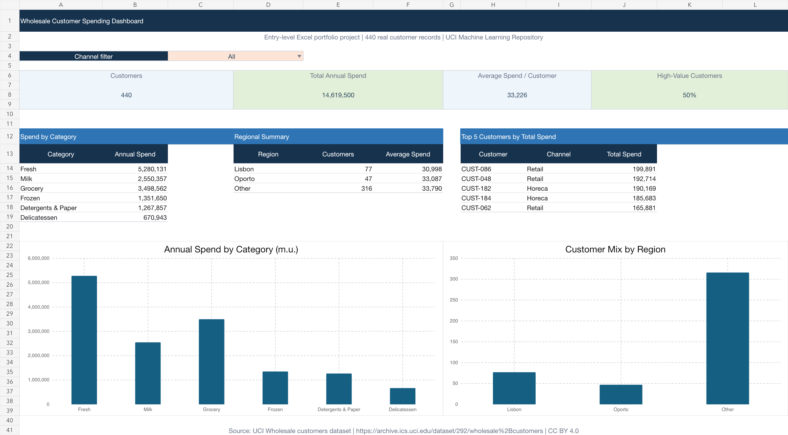

# Excel Wholesale Customer Analysis

An Excel analysis of annual spending patterns for 440 customers of a wholesale distributor, built from the UCI Wholesale Customers dataset.

This project uses a real public dataset from the UCI Machine Learning Repository. No transaction or customer record has been invented. The `CUST-001` to `CUST-440` labels are derived row identifiers added only to make the workbook easier to review.



## Project goal

Build a clear, auditable Excel workbook that answers practical business questions:

- How much do customers spend overall and by product category?
- How do Horeca and Retail customers differ?
- How is the customer base distributed across regions?
- Which customers have the highest total annual spend?

The workbook focuses on core spreadsheet analysis: data preparation, formulas, structured tables, filters, conditional formatting, and charts. Macros and VBA are not required for this analysis.

## Excel skills demonstrated

- Structured Excel tables with filters and frozen panes
- Cross-sheet references from raw data to a clean analysis table
- `VLOOKUP` for channel and region mapping
- `SUM`, `SUMIF`, `COUNTIF`, `COUNTIFS`, `AVERAGEIF`, and `AVERAGEIFS`
- `IF`, `IFERROR`, `INDEX`, `MATCH`, `LARGE`, `SMALL`, and `COUNT`
- Data validation drop-down to switch the dashboard between All, Horeca, and Retail
- Conditional formatting for high-value customers and total-spend data bars
- Native Excel charts linked to formula-driven summary tables
- Source notes, lookup tables, and transparent transformation rules

## Key findings

- The dataset contains 440 customers with total annual spending of 14,619,500 monetary units (m.u.).
- Fresh products are the largest category at 5,280,131 m.u., or 36.1% of total spending.
- Retail customers have higher average annual spend per customer: 46,619 m.u. versus 26,844 m.u. for Horeca customers.
- Horeca has more customers (298 versus 142), so its total annual spend is still higher: 7,999,569 m.u. versus 6,619,931 m.u.
- The "Other" region contains 316 of 440 customers and 10,677,599 m.u. of annual spending.

These are descriptive observations from this historical, anonymised dataset. They should not be treated as causal findings or a forecast.

## How to review the project

1. Download [`Wholesale_Customer_Spending_Analysis.xlsx`](excel/Wholesale_Customer_Spending_Analysis.xlsx).
2. Open the `Dashboard` sheet and change the channel filter in cell `C4`.
3. Inspect `Clean Data` to see the derived formulas and conditional formatting.
4. Inspect `Raw Data` to compare the analysis table with the original source records.
5. Read `Lookups & Notes` for definitions, mapping rules, source links, and limitations.

## Repository structure

```text
.
├── README.md
├── data/
│   ├── README.md
│   └── Wholesale customers data.csv
├── docs/
│   ├── data_dictionary.md
│   └── project_notes.md
├── excel/
│   └── Wholesale_Customer_Spending_Analysis.xlsx
└── images/
    └── dashboard-preview.png
```

## Data source and licence

- Dataset: [Wholesale customers — UCI Machine Learning Repository](https://archive.ics.uci.edu/dataset/292/wholesale%2Bcustomers)
- DOI: [10.24432/C5030X](https://doi.org/10.24432/C5030X)
- Creator: Margarida Cardoso
- Licence: [Creative Commons Attribution 4.0 International](https://creativecommons.org/licenses/by/4.0/)
- Original dataset: 440 rows, 8 fields, no missing values reported by UCI
- Values are annual spending in monetary units (m.u.); the source does not specify a currency

The included CSV is the unmodified file from the official UCI download. See [`data/README.md`](data/README.md) for provenance and checksum information.
